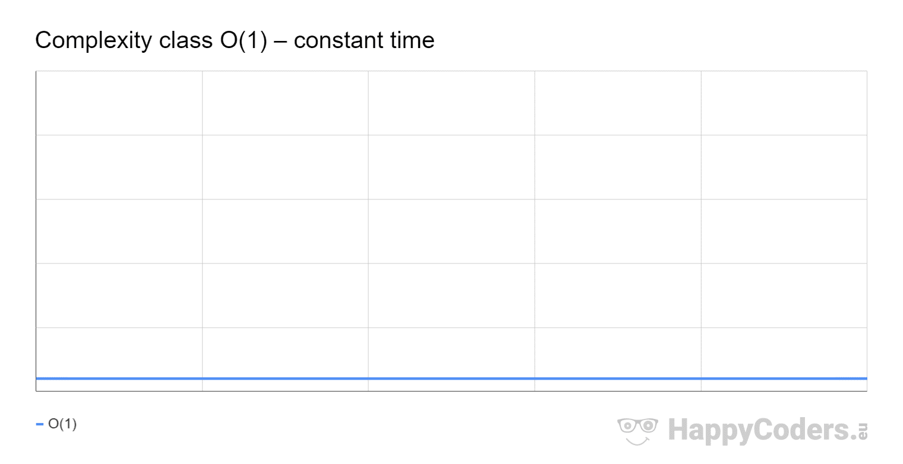

<h1>Big-O Notation</h1>

The first principle to understand with data structures is efficiency. Have you ever opened a program and it takes forever to load? It can be infuriating. Where a slow program can be an irritant to a customer it can be a deal breaker when it comes to clients or huge systems. 

<ul>
<li>
Big-O Notation is also referred to as time complexity. In coding we deal with large amounts of data all the time, and if we are not carful our algorithms can essentially get clogged or run at minimum efficiency. 
 </li>
<li>
There are ways to design algorithms that are very efficient with the time it takes for them to compute or the amount of memory they consume. Those are the two measurements on the y axis when we graph Big O, time, or space. You can have an algorithm that computes very efficiently, but if it takes up all the memory then it can become inefficient. You can also have an algorithm that takes little memory but gives little performance therefore increases time it takes for the algorithm to finish. 
</li> 
</ul>

    def find_five(list):
        for i in list:
            if i = 5:
                print(i)
        return false
    
 

 The algorithm above has a Big-O notation of O(1). Big-O notation is what we refer to when we are talking about time or space efficiency. 

<ul><li>We decide how much data is going through the loop by basing it off the size of the list. If the list is only 5 numbers long it is no big deal, but say the list is 500000 numbers long. That would take a long time to find all the fives. Worse is if the list is unordered which is common it would take us N amount of time to find all the fives in the list. Which means the loop will run N number of times before it finds the data it is looking for. </li>
<li>This means that the worst-case scenario is O(n) the program will run if there is data. However, that is the worst case, best case is that there is one 5 and it is the first number in the list. This means that the for loop will run through the entire list, but with some simple modifications we can change it to accommodate that fact we know that 5 is at the beginning of the list. Which leads us to our next time O(1).</li></ul>

    def find_five(list):
        for i in list:
            if i == 5:
                print(i)
                return True
        return false
        
    list = [1, 2, 3, 4, 5]
    find_five(list)

 
<h2>O of 1</h2>

The best time efficiency is O(1) which means your program is the most efficient in time or it is the most efficient with memory. Below we can use this graph to show an example. When calculating Big-O remember it ignors constants.

 

If all programs could achieve this runtime, we would have close no load times or delays in programs, however when dealing with large amounts of data sometimes the most efficient time to achieve is a very slow runtime such as our previous example O(n). 

 
<h2>Big - O</h2>

The graph blow shows most of the other Big-O notation, as the line deviates from the x axis the program becomes more and more inefficient. 

 
 

Let us try some practice if the big O of the previous problem was O(n) what do you think this one would be? 

    for in blue:
        for in red:
            print('moo')

 First let us remember that one loop was O(n) if we take that n and multiply it by another n we get n2 which if you look aat our previous graph is a very inefficient in time or space since we need to loop through the first loop once but then loop through the second one however many times the size of data. 

 

Watch the following video to review what we have gone over. <a href = 'https://www.youtube.com/watch?v=__vX2sjlpXU'>Introduction to Big-O</a>. 
 

When you are done try to solve the following big-O practice down below.

    x = 5
    y = 2
    print(str(x + y))

  
Answer

  
 O(1). The code runs once and then it stops, no sorting through large data or 

 

    for i in blue:
        if i == blue:
            print(blue)

  
Answer

 
O(N). Remember from our first example, a loop has O(n) usually. 

    for i in blue:
        for y in red:
            print('moo')

  
Answer

 
O(N2). N * N = N2 each loop has O(N) you thne multiply them to see the time or space complexity. 

 

    for i in blue:
        for y in red:
            for z in green:
                print('moo')

  
Answer

 
O(N2). N * N * N= N3 This one may not be on the graph, but the principles still apply. 

hint: The last one is worse case.
 

    import itertools
    a_list = [1, 2, 3]

    permutations_object = itertools.permutations(a_list)
    permutations_list = list(permutations_object)

    print(permutations_list)

  
Answer

 
O(N!). Definetly don't want any of your algorithms to have this efficiency. It is nearly unusable. 

