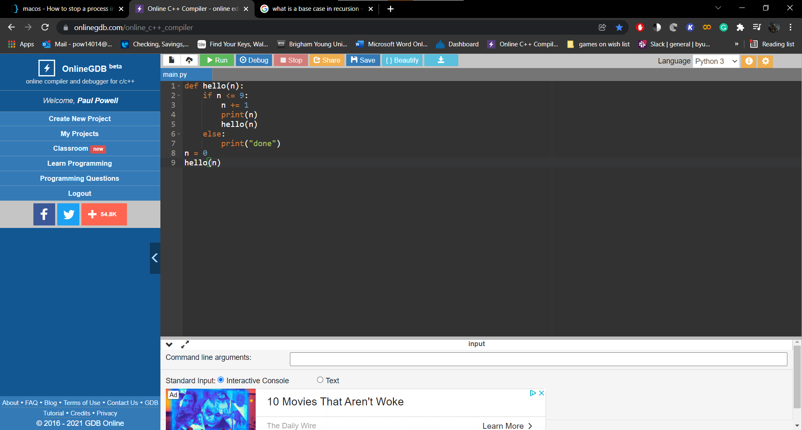
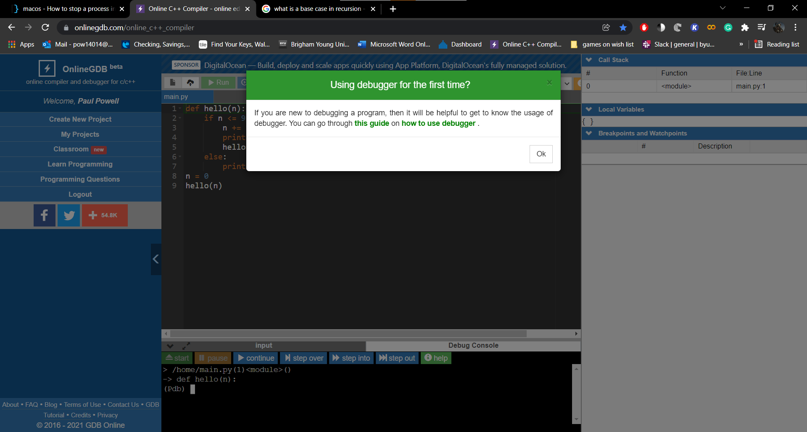
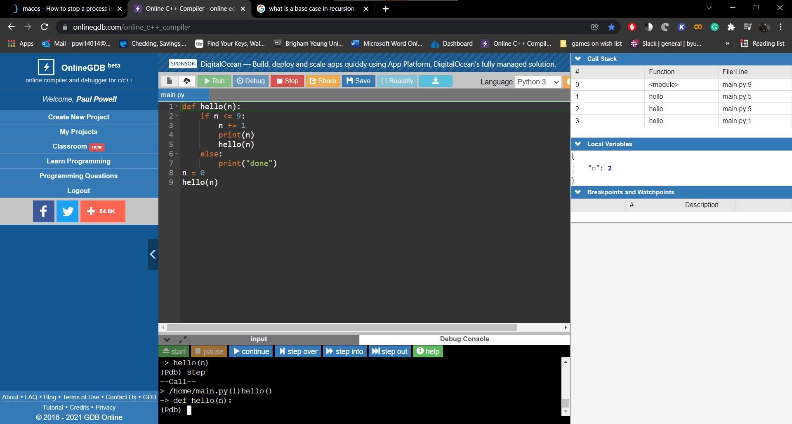

<h1>Recursion</h1>

What makes a programing language? What principles do program languages have that defines it as a programming language. There are three things a programming language must have to function as a coding language. 

First is operator execution, a line or place where you can execute operations, second branching statements. These are commonly referred to as if statements, however depending on the language the principle may be stated or executed otherwise. An example would be the final principle a language must have to be useful to a programmer and that is loops. Some way of repeating a task, function or operation until a certain requirement is satisfied. 

<h2>Loops vs Recursion</h2>
lets look at an example of a simple loop in python.

    for i in list:
        print(i)

Simple enough right? This will print whatever i is until the list is empty. Now imagine we are programming in Clojure. There are no loops in Clojure. If there are no loops, then how do we do recurring operations until a condition is satisfied? We use recursion. Recursion is the calling of a function within a function. 

An example in python would be.

    def num(n):
        if n <= 9:
            n += 1
            print(n)
            num(n)
        else:
            print("done")
    n = 0
    num(n)

We have a function called num. It counts to 10 by using recursion. One thing to understand is that RECURSION IS NOT LOOPING. The difference between recursion and looping is that recursion is a mechanism to call a function within the same function while looping is a control structure that allows execution of a set of operations again and again until the given condition is true or false. 

<h2>Basic faults</h2>

Recursion can be a very valuable tool especially when it comes to certain data structures like trees that we will cover in a later segment. A common pitfall when it comes to recursion though is getting stuck in an infinite loop. Thankfully python has measures that get you out of an infinite loop but not all languages have the same luxury. If you run code and your terminal is stuck or seems to be spitting out data without stopping Ctrl + C for Windows users will terminate the program in your terminal. For those who use Mac you will need to find out how to do that yourself because I could not find any references online. 

<h2>Base Case</h2>

To do recursion without falling into an endless loop you need to have a base case. A base case is a way to return without making a recursive call. It is the mechanism that stops the recursion from continuing indefinitely. What is the base case in the previous example? 

If you answered the if statement then you are correct. A way that can really help you understand recursion if you are still not grasping it is use a debugger. The one I prefer to use is on the website https://www.onlinegdb.com/online_c++_compiler.

<ol>
 <li>You copy and paste or type your code, make sure you have the correct compiler and then click the debug button. </li>
 <li> when you click the debug button this message should pop up. Feel free to follow the links and go through all the functions of the debugger if you wish but I will simply focus on a few aspects that help with following values. </li> 
 <li>If you want to know what is going on in the function you are at click the step into button and continue to click it and observe the right hand side of the screen and you will see your values and how they change. </li>
</ol>

This can be a valuable tool to follow your program and find out what your code is exactly doing and what is going wrong or right. 

<h2>Practice</h2>

Create a recursion function to do a countdown. 

  
Answer

    def countdown(begin):
        if begin == 0: 
            pass
        else:
            print(begin-1)
            countdown(begin-1)
        countdown(10)

Use recursion to find the factorial of a number.

  
Answer

    def factorial(num):
        if num == 1:
            return 1
        else:
            return (num * factorial(num-1))
    num = 5
    print(factorial(num))

