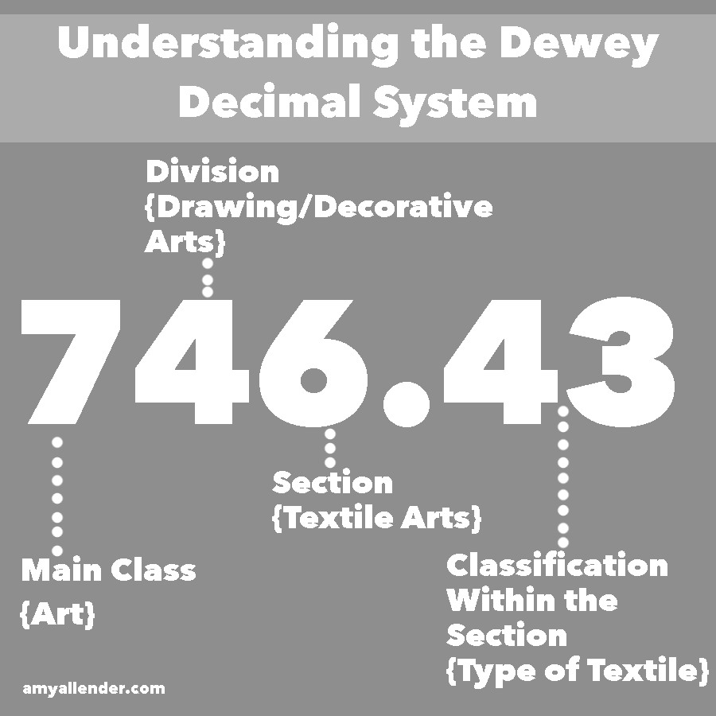

<h1>Sets</h1>

Sets are used to store multiple items in a single variable. they are very similar to lists, however they are unordered and they cannot have duplicates. What makes them more appealing than say a list is the time complexity.

    list = [5, 6, 6]

How would you go about itterating through this list? A simple solution would be a for loop where you start from the begining and look for what number you want, however we have a few problems with this method.

    for i in list:
        if i == 6:
            print(i)
<h2>Set Properties</h2>

first what if we have duplicates? We will print the first item that meets our perameters. second what if the list is 10000000000000 characters long? Remember a for loop has Big O of N meaning that it would take 10000000000000 in time complexity or space complexity which is unprefered and even in some cases unusable. 

What is so cool about a set is while they are similar to a list they are more like a phone book. Rather than looking for Z by starting at the begining, you know the letter therefore you would start near the end. To understand this concept we need to understand hashing.

<h2>Hashing</h2>

Hashing is when you transform a key or a string of characters into another value. One of the most popular forms of hashing is the implementation of hashing tables. A hash table stores the keys and the value pairs in a list that is accesable through the index.
The key value pairs are unlimited therefore the hash function maps the keys to the tables size. Then the hash value becomes the index for a specific element.

A real world example would be the Dewey Decimal system.

We have a main key, a subclass key and a section key. Then we have a clasification. When someone is looking for data or an item these numbers narrows the search, the same way hashing does for data that we need to find. 

<h2>Conflicts</h2>

There can be conflicts such as Untenable variables or violated contstraints. 
<ul>
<li>
If a variable becomes unatainable it appears in the set of conflict variable. If it becomes tenable it disapears. If variables become unatainable they must be reasigned in any solution. 
</li>
<li>
Using open addressing can medigate conflicts. This is where all elements are stored in the hash table itself. So the size of the table must be greater or euqal to how many keys there are. 
</li>
</ul>

<h2>Common misconception of sets</h2>

While the data in sets is unchangable, it also is changable. While you may not be able to change the elements directly, you can add or delete items in a set.
<h2>Methods</h2>

Similar to stacks or most other datastructures sets have built in functions that can carry out useful tasks.

<h3>add()<h3>

The add function adds an element to the set.

    set = {'item1', 'item2', 'item3'}
    set.add('itemblue')
    set.add('itemred')
    print(set)
The code would then print.
    
    {'item1', 'item2', 'item3','itemblue', 'itemred'}
<h3>Clear()</h3>

Removes all the elements of the set.

    letters = {'a', 'e', 'i', 'o', 'u'}
    print(letters)
    letters.clear()
    print(letters)

    {'a', 'e', 'i', 'o', 'u'}
    set()
<h3>copy()</h3>

Copy can be useful if you want to keep the original data.

    set = {3, 4, 5, 6}
    set1 = set.copy()

There are other methods that you can find on w3schools but for now we will only cover these.
<h3>discard()</h3>

The discard function removes a specific item from the set

    set = {3, 4, 5}
    set.discard(5)
    print(set)

    {3, 4}
<h2>Examples</h2>

Time for some examples and practice.

    set = {'moo', 'fish', 'cheese'}
    print(set)

    {'moo', 'fish', 'cheese'}

Similare to a list a set can contain strings, integers, floats, and other data types. Including other sets making it a sort of subset. We can even turn a list into a set with the set function.

    list = [3, 4, 5, 6, 7]
    list = set([3, 4, 5, 6, 7])
    print(list)
<h2>Practice</h2>

create a set and then itterate through it. Hint: how would you itterate through a list

  
Answer

  
    set = {'one', 'two', 'three'}
    for i in set:
        print(i)

Create a set and copy it, then add 3 new items to it and print both sets

  
Answer

  
    set = {'one', 'two', 'three'}
    copy = set.copy()
    copy.add('four')
    copy.add('five')
    copy.add('six')
    print(copy)

