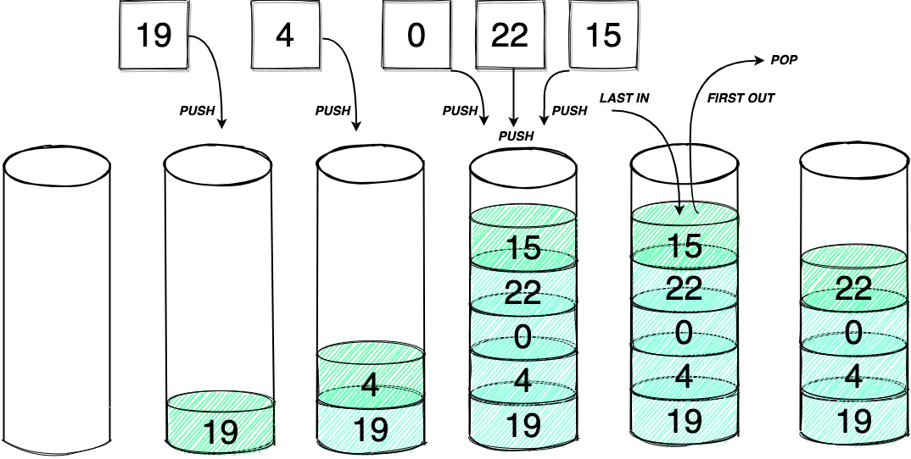
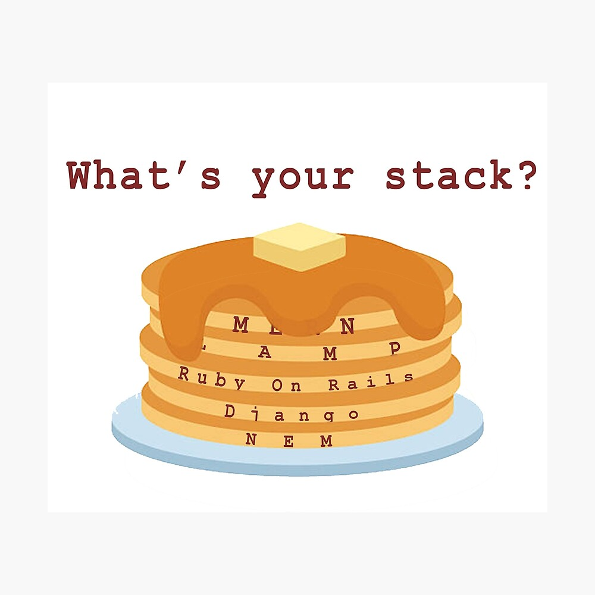

<h1>Stacks</h1>

A stack is a linear data structure. It stores items in a list and can be acces from the last end.
 
 

 

This is refered to as (LIFO) Last in first out a queue which is the same principle except it is accessed as (FILO) first in last out.
 

 

A real world metaphore for a stack would be a stack of pankakes. You stack them up and usually eat the first one on the top of the stack. The one on the top of the stack is the first one out of the stack. 

<h2>Stack vs Queue</h2>

When to use a queue vs a stack. An example would be a line of customers. Whoever is first should be the first out of line. The difference between the two is how you acces the stack or queue. Last in First out, or First in Tirst out.

<h2>Functions</h2>

There are built in functions for the stack that you can use to manipulate the data within or add and take away data.

<ul>
<li>empty()</li>
<li>size()</li>
<li>top()</li>
<li>push(a)</li>
<li>pop()</li>
</ul>
 

<h3>Push(value)</h3>

Appends an item to the end of a stack. 
Time O(1)

    list = []
    list.append(1)
    list.append(2)
    list.append(3)
    print(list)

    [1, 2, 3]
<h3>Empty()</h3>

Returns weather the stack is empty or not.  Time O(1)

    if len(list) == 0:
        print(list)

    []
<h3>Size()</h3>

Returns the size of the stack 
Time O(1)

    length = len(list)
    print(length)

    3
<h3>Pop()</h3>

deletes the topmost element of a stack 
Time O(1)

    list.pop()
    print(list)

    [1,2]
<h2>Time</h2>

Notice all of the runtimes for each of the functions is the best possible O(1). This means that regardless of the size of data it will be close to instantanious. 

<h2>Practice</h2>

Push three numbers to the stack and get rid of the last number added

    stack = []

  
Answer

    
    stack = []
    stack.append(0)
    stack.append(1)
    stack.append(2)
    stack.pop()
    print(stack)

    [0,1]

Get the size of your previous stack and add that number to the stack

  
Answer

    
    stack = []
    stack.append(0)
    stack.append(1)
    stack.append(2)
    stack.append(5)
    stack.pop()
    length = len(stack)
    stack.append(length)
    print(stack)

    [0,1,2,3]

